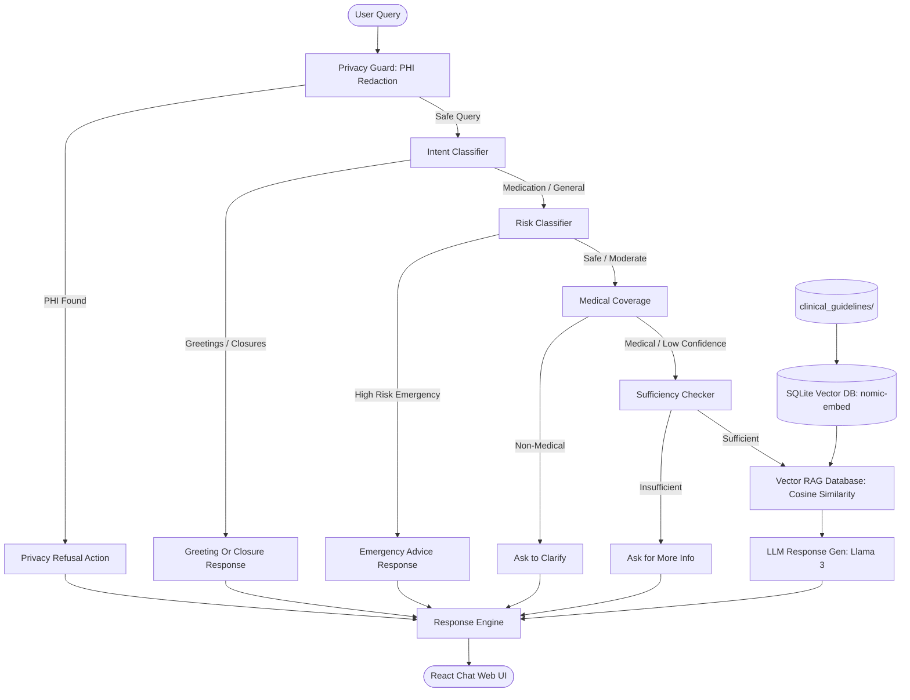

# Healthcare AI Safety Assistant

A safety-first healthcare assistant that puts strict, rule-based safety checks in front of any large language model. The goal is to prevent unsafe medical advice, minimize hallucinations, and provide predictable, audit-friendly behavior for healthcare queries.

---

## What This Project Does (In One Go)

When a user asks a health question, the system does not answer immediately. It first runs the query through a safety firewall that checks intent, risk, high-impact topics, and medical coverage. Only if the query is considered safe and sufficiently detailed does the LLM respond. High-risk or unsafe paths never reach the model and instead return fixed, safety-compliant responses.

This makes the assistant reliable and conservative by design, which is critical for healthcare use cases.

---

## Novelty (Why This Is Not Just a Basic Chatbot)

- Rule-first safety firewall that blocks unsafe queries before LLM output.
- Negation-aware risk detection (handles phrases like "no fever").
- Medical coverage detection to avoid answering non-medical or vague queries.
- Structured LLM sufficiency check (strict JSON) instead of free-form responses.
- Deterministic crisis, emergency, and refusal responses (no hallucination risk).
- Fully logged decisions with evidence tags for auditing.

---

## Current Architecture (Implemented v1.5)

1) Privacy & Consent Guard (lightweight)
    - PHI redaction for emails/phones/IDs, privacy-safe logging
2) Pre-LLM Safety Gate (Zero-Trust Firewall)
	- Intent classification (self-harm, overdose, violence, medication guidance)
	- Risk detection (emergency red-flags, negation-aware)
	- High-impact topics (age extremes, pregnancy, anticoagulants, diabetes, immunocompromised)
	- Medical coverage detection (symptoms/body/conditions/med terms + non-medical + low confidence)
3) Retrieval / Knowledge Grounding (lightweight)
    - Keyword-based evidence snippets and citations
4) Sufficiency Verification (LLM JSON Validator)
	- Age + symptoms + duration, strict JSON output
5) Confidence Calibration (lightweight)
    - Heuristic confidence scoring for escalation
6) Decision Orchestrator
	- Priority rules: SELF_HARM_CRISIS → SAFETY_REFUSAL → EMERGENCY_ADVICE → ASK_MORE_INFO → CAUTION_ADVICE → SAFE_TO_RESPOND → ASK_CLARIFY
7) Response Engine (Hybrid)
	- Fixed safe responses for crisis/refusal/emergency/clarify
	- LLM responses for ask-more/caution/safe
8) Human Escalation Path (lightweight)
    - Escalation flags for crisis/emergency/low confidence
9) Audit + Observability
	- Structured logs + evidence tags + rule traces

LLM is gated. Unsafe paths never reach the model.

---

## Where GenAI Is Used (And Where It Is Not)

- GenAI is used for:
  - Sufficiency checking (LLM outputs strict JSON)
  - Safe response generation for low-risk paths
- GenAI is not used for:
  - Risk classification
  - Intent detection
  - Decision routing
  - Emergency/self-harm/refusal responses

This is a safety-first GenAI Orchestration and framework built on top of a LLM,  not a purely LLM-driven system.

---

## Proposed Architecture (Target v2)

Planned upgrades to make it production-grade:

1) Privacy & Consent Guard
	- PHI redaction, anonymization, encryption, consent checks
2) Retrieval / Knowledge Grounding (RAG)
	- Clinical guidelines (WHO/CDC/NIH), drug safety databases, citations
3) Confidence Calibration
	- Uncertainty scoring + fallback thresholds
4) Human Escalation Path
	- Doctor/human review/hotline escalation for crisis, emergency, or low confidence

These are included in the proposed architecture diagram. Current implementation uses lightweight stubs.

---

## Implemented Production-Grade Architecture (v2.0)

We have fully implemented the planned v2.0 upgrades to make the system clinical-grade:

### Detailed Explanation of the Whole Project

PulseGuard AI is a safety-first, zero-trust medical AI orchestrator. Rather than letting user queries run directly into a generative Large Language Model (which is prone to hallucinations, diagnostic overreach, or unsafe prescription advice), PulseGuard acts as a deterministic, multi-layered firewall. The LLM is only utilized at the end of the pipeline for safe, sufficient, and low-risk informational queries, and its answers are strictly grounded in an SQLite clinical knowledge base.

#### 1) The Triage Pipeline Flow
Each query passes through the following steps in sequence:
1. **PII Filtering:** Redacts emails, SSNs, and phone numbers (including Indian and international styles). If PII is found, the system blocks the query immediately via `PRIVACY_REFUSAL`.
2. **Intent Classification:** Identifies self-harm, drug overdose, violence, illegal misuse, greetings, or medical advice.
3. **Risk Classification:** Identifies emergency symptoms (e.g., chest pain, breathing difficulty, heavy bleeding) or moderate conditions. High-risk symptoms instantly trigger a deterministic `EMERGENCY_ADVICE` bypass.
4. **Medical Coverage Check:** Validates whether the query is actually related to medical topics. Non-medical queries (like coding, sports, or weather) are deflected with `ASK_CLARIFY`.
5. **Sufficiency Check:** A structured JSON validation (LLM-driven with heuristic fallback) verifying if the user has provided **Age**, **Symptoms**, and **Duration**. If any are missing, the orchestrator requests them via `ASK_MORE_INFO`.
6. **Dynamic Knowledge Retrieval (Vector RAG):** For valid, sufficient queries, the system queries a local SQLite vector store (`data/clinical_knowledge.db`) using `nomic-embed-text` embeddings generated via Ollama. It retrieves the most relevant clinical guidelines from NIH, CDC, or WHO. If Ollama is offline, it falls back to a custom inverted keyword-matching index.
7. **LLM Response Generation:** Generates the final output using local `llama3` via Ollama, strictly instructed to avoid diagnosing or naming drugs, and appends source citations.

---

### Project Architecture & Module Directory

Clickable links to the implementation files:

* [config.py](file:///C:/Users/voltt/OneDrive/Desktop/healthcare_llm_project/modules/config.py): Centralized environment and model configurations (`LLM_MODEL` and `EMBEDDING_MODEL`).
* [privacy_guard.py](file:///C:/Users/voltt/OneDrive/Desktop/healthcare_llm_project/modules/privacy_guard.py): Redacts emails, SSNs, and international phone numbers. Flags consent requirements.
* [intent_classifier.py](file:///C:/Users/voltt/OneDrive/Desktop/healthcare_llm_project/modules/intent_classifier.py): Uses regex heuristics to classify intent into critical safety categories or greetings.
* [risk_classifier.py](file:///C:/Users/voltt/OneDrive/Desktop/healthcare_llm_project/modules/risk_classifier.py): Evaluates queries for high-risk red-flag symptoms and moderate symptoms using negation-aware parsing.
* [high_impact.py](file:///C:/Users/voltt/OneDrive/Desktop/healthcare_llm_project/modules/high_impact.py): Detects high-risk patient contexts (elderly, infants, pregnancy, immunocompromised, anticoagulants, etc.).
* [medical_extractor.py](file:///C:/Users/voltt/OneDrive/Desktop/healthcare_llm_project/modules/medical_extractor.py): Normalizes patient ages (including month-to-year parsing, e.g. "6-month-old" -> 0.5 years), extracts durations, and identifies medical terms.
* [medical_coverage.py](file:///C:/Users/voltt/OneDrive/Desktop/healthcare_llm_project/modules/medical_coverage.py): Distinguishes medical inquiries from general greetings or non-medical topics (programming, sports, etc.).
* [retrieval_layer.py](file:///C:/Users/voltt/OneDrive/Desktop/healthcare_llm_project/modules/retrieval_layer.py): Dynamic RAG vector store backed by SQLite, featuring local chunk embedding, cosine similarity calculation, and fallback keyword lookup.
* [sufficiency_checker.py](file:///C:/Users/voltt/OneDrive/Desktop/healthcare_llm_project/modules/sufficiency_checker.py): Checks for the presence of Age, Symptoms, and Duration using a structured JSON-mode LLM prompt with a deterministic fallback.
* [confidence_calibrator.py](file:///C:/Users/voltt/OneDrive/Desktop/healthcare_llm_project/modules/confidence_calibrator.py): Evaluates pipeline confidence scores to determine whether fallback or human escalation is needed.
* [safety_rules.py](file:///C:/Users/voltt/OneDrive/Desktop/healthcare_llm_project/modules/safety_rules.py): Implements the priority-ordered decision engine mapping classified signals to final orchestrator actions.
* [escalation_router.py](file:///C:/Users/voltt/OneDrive/Desktop/healthcare_llm_project/modules/escalation_router.py): Handles human reviewer or crisis helpline routing based on rule violations or low confidence.
* [response_generator.py](file:///C:/Users/voltt/OneDrive/Desktop/healthcare_llm_project/modules/response_generator.py): Formulates deterministic safety responses for refusals, emergencies, and follow-ups, and prompts the LLM dynamically for safe responses (with grounded citations).
* [text_utils.py](file:///C:/Users/voltt/OneDrive/Desktop/healthcare_llm_project/modules/text_utils.py): Holds core text cleanup utilities and the negation coordination boundary checks.

---

### System Architecture Data Flow



---


---

## Quick Start

### 1) Install Ollama (required for LLM responses)

Download:
https://ollama.com

Install model:

```
ollama pull llama3
```

### 2) Clone the repository

```
git clone <repo-url>
cd unanswerabilty-aware-ai-for-medical-use-
```

### 3) Create virtual environment

```
python -m venv .venv
.venv\Scripts\activate
```

### 4) Install dependencies

```
pip install -r requirements.txt
```

### 5) Run the demo

```
python test_full_pipeline.py
```

You should see:

```
Healthcare AI Assistant Started
Enter your medical query:
```

---

## Tests

```
python test_safety_filters.py
python test_risk_checker.py
python test_sufficiency_checker.py
python test_decision_engine.py
python test_medical_coverage.py
python test_v2_components.py
```

---

## Key Modules

- modules/decision_engine.py
- modules/intent_classifier.py
- modules/risk_classifier.py
- modules/high_impact.py
- modules/medical_extractor.py
- modules/medical_coverage.py
- modules/privacy_guard.py
- modules/retrieval_layer.py
- modules/confidence_calibrator.py
- modules/escalation_router.py
- modules/safety_rules.py
- modules/sufficiency_checker.py
- modules/response_generator.py
- modules/text_utils.py

---

## Frontend Integration (Completed in v2.0)

* **Flask API ([app.py](file:///C:/Users/voltt/OneDrive/Desktop/healthcare_llm_project/app.py)):** Completed backend endpoints supporting session-based multi-turn dialog history.
* **Web Chat UI ([index.html](file:///C:/Users/voltt/OneDrive/Desktop/healthcare_llm_project/index.html)):** Premium React frontend using a glassmorphic design system.
* **API integration:** Seamless stateful chat pipeline between frontend and backend.

---

## Authors

Backend AI System:
(Aditya Akshat Singh)

Frontend & API:
(Vishnu Chitturi)
